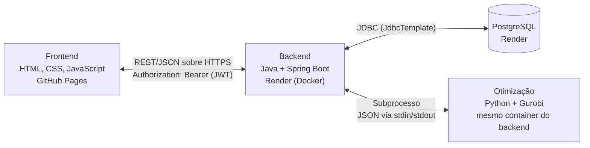

# Arquitetura — Mente Fria

**Equipe:** Leonardo Fagundes Oliveira (RA 2840482421009), Diogo Pereira Miranda (RA 2840482423006), Lucas Gabriel Valadares Bassi (RA 2840482423008), Kauê Nogueira Carneiro (RA 2840482423039)

**Trilha:** B (Origem do problema: Cliente Real)

**Última atualização:** 25/09/2026

> **Status:** decisões D1 a D5 validadas pela equipe em 18/09/2026 (D4 registrada com base na experiência declarada da equipe — ver seção 2). Itens marcados como **proposta** ainda não foram validados e devem ser confirmados na implementação. As pendências estão na seção 8.
>
> **Contrato de Comunicação (20/09/2026):** as fronteiras **Java ↔ Python** e **Frontend ↔ Java** passam a ser definidas por `docs/Contrato_de_Comunicacao_Mente_Fria.md`, que **prevalece sobre este documento** nos nomes de campo, nos valores de `status` e no formato de erro. As seções 3.1 e 3.3 abaixo resumem o contrato e apontam para ele.
>
> **Decisões de versão e configuração (25/09/2026):** o grupo respondeu as pendências de ambiente e configuração desta seção (detalhamento em `Pendencias_ARQUITETURA_para_o_grupo.md`). O resultado está nas seções 2, 5 e 8, abaixo.

---

## 1. Visão geral



Princípios que valem para todo o projeto:

1. **Só o backend fala com o banco e com o módulo Python.** O frontend nunca acessa nenhum dos dois diretamente.
2. **Permissões e regras de negócio vivem no backend.** O frontend apenas apresenta e esconde menus; nunca é a única barreira de segurança.
3. **O módulo Python é uma função pura:** recebe dados em JSON, devolve o resultado em JSON. Não acessa o banco nem recebe requisições do navegador. Isso é coerente com o Diagrama de Classes, em que o resultado da otimização fica em memória, sem histórico persistido.

---

## 2. Decisões de arquitetura

| # | Decisão | Alternativas consideradas | Motivo |
|---|---|---|---|
| D1 | **PostgreSQL** como banco oficial | MySQL | Render não oferece MySQL gerenciado gratuito. Migração registrada em `DER.md` (16/09/2026). |
| D2 | **Java chama o Python como subprocesso**, trocando JSON por stdin/stdout | (B) Python como serviço HTTP (Flask/FastAPI); (C) Python lendo o banco direto | Um único serviço no Render, sem framework web extra e menos processos para subir localmente. (C) foi descartada: duplica acesso a dados e contorna as regras do backend. O contrato JSON fica atrás de uma interface no Java, então trocar por (B) depois não afeta o resto do sistema. |
| D3 | **JWT no header `Authorization`** | Sessão por cookie; frontend servido pelo próprio Spring | Frontend (`github.io`) e backend (`onrender.com`) estão em domínios diferentes; cookies entre eles sofrem bloqueio em alguns navegadores. JWT não depende de estado no servidor (o plano Free reinicia o serviço) e não exige proteção CSRF. Servir o frontend pelo Spring exigiria abandonar o GitHub Pages (muda o Termo de Aceite). |
| D4 | **Spring `JdbcTemplate`** (`NamedParameterJdbcTemplate`) para acesso a dados | Spring Data JPA/Hibernate; JDBC puro | A equipe nunca usou JPA; o Lucas conhece JDBC. O SQL já existe (DDL, constraints, consultas do dashboard) e fica visível e revisável. Evita a curva do JPA e as armadilhas de chave composta em `produto_ingrediente` e `pedido_produto`. Custo: mais código por CRUD. Pode ser revisitada. |
| D5 | **Python/Gurobi apenas para a recomendação de produção** (US10/US11) | Incluir reposição (US14) e marketing (US18) | Nos documentos, US14 e US18 aparecem como métodos de `Ingrediente`/`Produto`, sem menção a Programação Linear. Ficam em Java. |

Confirmado pela equipe em 18/09/2026: o plano Free do Render aceita Docker (necessário para a D2).

### 2.1 Versões e ferramentas (decididas em 25/09/2026)

| Item | Decisão | Observação |
|---|---|---|
| JDK | **21 (LTS)** | |
| Spring Boot | **3.3.4** | **Atenção:** a linha 3.3.x está fora do período normal de suporte desde novembro de 2024 (quase 2 anos), sem receber mais correções de segurança. Ver nota no fim desta seção. |
| Build | **Maven** | Mantém os comandos já usados no README e no Roteiro (`mvn spring-boot:run`, `mvn test`) |
| Python | **3.14.7** | **Atenção:** ver nota no fim desta seção sobre compatibilidade com o Gurobi. |
| Gurobi | A confirmar | O time vai instalar a versão mais recente disponível via `pip install gurobipy` e conferir a compatibilidade com o Python 3.14 antes de seguir (ver nota abaixo) |
| Licença Gurobi | **WLS (Web License Service)** | Decidida antecipadamente (a recomendação original era decidir só perto do deploy); as credenciais entram como variáveis de ambiente (seção 5) |
| Autenticação | **Spring Security + biblioteca de JWT** (ex.: `jjwt`) | |
| Conversão de porções (item B1 do Contrato) | **O frontend converte**, usando a `porcao_padrao` de cada ingrediente | Fecha também o item B1 da seção 2.4 do Contrato de Comunicação |
| Ingredientes vencidos na otimização | **Não contam** como estoque disponível | O Java filtra antes de montar o JSON para o Python |
| Responsável pelo módulo Python | **Kauê** | |

> **Duas decisões pedem atenção antes de avançar:**
> - **Spring Boot 3.3.4** está fora do período normal de suporte (OSS) desde novembro de 2024, com vulnerabilidades de segurança já conhecidas e sem correção nessa linha. Para um projeto que começa agora, o caminho comum seria uma versão ainda mantida (3.5.x, com suporte até meados de 2026, ou 4.0.x, a atual). Vale a equipe confirmar se a escolha por 3.3.4 foi intencional (por exemplo, para seguir algum material de estudo específico) antes de gerar o projeto em start.spring.io.
> - **Python 3.14** é muito recente (lançado em outubro de 2025). Até a data da última pesquisa (24/09/2026), a página oficial do Gurobi confirmava suporte até o Python 3.13; o suporte ao 3.13 só veio com uma versão específica do Gurobi (12.0.1), e o suporte ao 3.14 pode ainda depender de uma versão do Gurobi que os canais de suporte oficiais indicavam como prevista, sem confirmação de que já foi lançada. **Antes de codar o `otimizador.py` de verdade**, o Kauê deve rodar `pip install gurobipy` num ambiente com Python 3.14 e testar um exemplo simples; se der erro de instalação ou de compatibilidade, o caminho mais seguro é recuar para Python 3.12, como a pendência original já sugeria.


O **Contrato de Comunicação** (mantido pelo Kauê; revisado e aprovado em 20/09/2026) detalha as rotas REST, os erros e o formato JSON trocado com o Python.

---

## 3. As três ligações

### 3.1 Frontend ↔ Backend — REST/JSON sobre HTTPS

- **CORS:** o backend libera apenas a origem do GitHub Pages do projeto (e `localhost` em desenvolvimento).
- **URL da API:** site estático não tem variáveis de ambiente. A URL base fica em um `config.js` do frontend, com valores para local e produção.
- **HTTPS:** obrigatório (o GitHub Pages é HTTPS; chamadas HTTP seriam bloqueadas como *mixed content*). O Render já fornece certificado.
- **Autorização:** sempre validada no backend por perfil (CT05, CT08 e critério de bloqueio nº 5 do Plano de Testes).
- **Contrato:** rotas, formato de erro, códigos HTTP, CORS e convenções do JSON estão no **Contrato de Comunicação** (§2), que prevalece sobre este documento. Em resumo:
  - JSON em **snake_case**, com os mesmos nomes do DER.
  - Erro no formato `{ "mensagem": "...", "campos": { "campo": "mensagem" } }`, com **vários campos de uma vez** quando for o caso (US7); as mensagens vêm de `docs/mapa_constraints.md`.
  - Códigos: `400` validação de campo ou regra de cadastro; `401` sem token/token inválido/credenciais inválidas; `403` perfil sem permissão; `404` inexistente; `409` conflito (e-mail duplicado; Administrador já existe); `422` regra de negócio de uma operação (estoque insuficiente).
- **Cold start:** no plano Free do Render, a primeira chamada após inatividade pode demorar (verificar os limites atuais). O frontend deve ter um estado de "carregando" claro.

### 3.2 Backend ↔ Banco — JDBC (`JdbcTemplate`)

- Credenciais sempre por variáveis de ambiente (`DB_*`), nunca no código.
- O `Script_DDL.sql` é a **fonte do schema**. A aplicação não cria nem altera tabelas.
- Todo SQL usa parâmetros (`?` ou nomeados). **Nunca** concatenar texto de entrada no SQL.
- Um `Repository` por agregado, isolando o SQL. As regras de negócio ficam nos `Service`.
- **Transações:** o registro de pedido (US12) grava `pedido`, `pedido_produto`, baixa de `ingrediente.quantidade_estoque` e insere movimentações `SAIDA` em **uma única transação** (CT25). A escolha FEFO das entradas é aplicada nessa mesma transação.
- As consultas agregadas do dashboard (US17) são escritas em SQL explícito.

### 3.3 Backend ↔ Python/Gurobi — subprocesso com contrato JSON

**Como funciona**

1. O backend lê o estoque, os produtos ativos e as composições no banco e monta o JSON de entrada.
2. Executa `python optimization/otimizador.py` (`ProcessBuilder`) e envia o JSON pela entrada padrão.
3. Lê o JSON de saída na saída padrão, com **timeout de 10 s** (provisório, conforme o contrato).
4. Devolve o resultado ao frontend em linguagem de negócio (sem termos de otimização — US11).

No Java, a chamada fica atrás de uma interface (ex.: `OtimizadorProducao`), o que permite trocar a implementação e testar o restante com um dublê.

**Contrato**

A requisição, a resposta e as regras estão no **Contrato de Comunicação** (§1), que prevalece sobre este documento. Em resumo:

- **Nomes iguais aos do DER:** entrada com `ingredientes[].quantidade_estoque` e `produtos[].composicao[].quantidade_utilizada`; saída com `status` (`"sucesso"` ou `"erro"`), `receita_estimada` e `recomendacao` (**um item por produto recebido**, com `quantidade` inteira ≥ 0).
- **O Java envia todos os ingredientes usados por produtos ativos, inclusive os com estoque 0.** Nunca se filtra por "estoque > 0": se um ingrediente em falta sumisse da lista, o Python não saberia limitar os produtos que o usam. Só entram produtos com `ativo = true`.
- Estoque e quantidades chegam **na mesma unidade do ingrediente** (kg, l, un). Quem converte porções (Tela 09) em quantidade é o **frontend** (item B1 do contrato, a confirmar com Leonardo e Lucas).
- "Estoque insuficiente para qualquer produto" é **`sucesso`** com todas as quantidades 0; o frontend mostra uma mensagem amigável. O `erro` fica para problemas de dados (produto sem composição, ingrediente ausente da lista).
- **Código de saída `0`** = há JSON válido na `stdout` (inclusive com `status: "erro"`); diferente de `0` = falha técnica (o `stderr` vai para o log). **UTF-8** nas duas pontas. **Timeout de 10 s** (provisório). O backend nunca expõe *stack trace* ao usuário.
- `receita_estimada` é informativa: o Java **recalcula com `BigDecimal`** a partir das quantidades e dos preços.
- O modelo matemático (variáveis, função objetivo, restrições) será detalhado e validado com a equipe no início da Sprint 2.

---

## 4. Autenticação e autorização

```
1. POST /api/auth/login   { email, senha }   →  { token, nome, perfil }
2. Frontend guarda o token e redireciona conforme o perfil (US3)
3. Demais chamadas:       Authorization: Bearer <token>
4. Backend valida assinatura e validade, depois confere se o perfil acessa a rota
   →  200, ou 401 (token inválido/expirado), ou 403 (perfil sem permissão)
```

- O token carrega id do usuário, perfil e validade. **Validade curta** (proposta: 1 a 2 horas). Não há revogação antes de expirar — aceitável para o MVP.
- Senhas armazenadas apenas como hash (`senha_hash`); mínimo de 8 caracteres validado na aplicação (US1, CT02).
- A chave de assinatura fica em variável de ambiente (`JWT_SECRET`). **Nunca** no código nem no repositório.
- O token fica em JavaScript no navegador, então o frontend deve evitar `innerHTML` com dados digitados por usuários (mitigação de XSS).

---

## 5. Variáveis de ambiente

| Variável | Usada por | Descrição | Status |
|---|---|---|---|
| `DB_HOST`, `DB_PORT`, `DB_NAME`, `DB_USER`, `DB_PASSWORD` | Backend | Conexão com o PostgreSQL | Já no README |
| `JWT_SECRET` | Backend | Chave de assinatura dos tokens | A incluir no README |
| `CORS_ALLOWED_ORIGIN` | Backend | Origem do frontend liberada no CORS | A incluir no README |
| `PYTHON_CMD` | Backend | Comando para chamar o Python (`python`, `python3` ou `py`, conforme a máquina) | A incluir no README |
| `OTIMIZADOR_SCRIPT` | Backend | Caminho do script `otimizador.py`, relativo à pasta de onde o backend inicia | A incluir no README |
| `GRB_WLSACCESSID`, `GRB_WLSSECRET`, `GRB_LICENSEID` | Python | Credenciais da licença Gurobi WLS (decidida em 25/09/2026) | A incluir no README |

O `.env` real nunca é versionado; o `.env.example` lista as variáveis sem valores.

---

## 6. Deploy

| Bloco | Onde | Observação |
|---|---|---|
| Frontend | GitHub Pages | Arquivos estáticos |
| Backend + Python | Render, **um serviço** via Dockerfile (JRE + Python + `gurobipy`) | Docker no plano Free confirmado pela equipe |
| Banco | PostgreSQL gerenciado do Render | Limites do plano Free descritos no `DER.md` |

Recomendação: **fazer o deploy do "esqueleto"** (passos 2 e 3 da seção 7) já no fim da Sprint 1, mesmo com a US20 prevista para a Sprint 4. É nesse momento que aparecem CORS, HTTPS, Dockerfile, licença Gurobi e cold start; descobrir isso cedo evita retrabalho. Medir também o consumo de memória do container com Java + Python (o plano Free tem limite de RAM — confirmar o valor atual).

---

## 7. Roteiro de implementação

| # | Passo | O que prova | Sprint |
|---|---|---|---|
| 1 | Subir PostgreSQL local (Docker) e rodar `Script_DDL.sql` com o seed | Banco reproduzível por todos | 1 |
| 2 | Backend conecta ao banco; `GET /api/saude` (`SELECT 1`) e `GET /api/ingredientes` | Backend ↔ Banco | 1 |
| 3 | Página HTML que faz `fetch` em `/api/ingredientes` e lista o resultado, com CORS | Frontend ↔ Backend ponta a ponta | 1 |
| 4 | Login por perfil com JWT; frontend trata 401/403 (US1–US3) | Autenticação e autorização | 1 |
| 5 | `otimizador.py` + `pytest` (CT23, CT24) usando o contrato JSON, sem Java | Módulo Python isolado e testável | 2 |
| 6 | `POST /api/producao/recomendacao` (só Administrador) chamando o Python | Backend ↔ Python | 2 |
| 7 | Deploy do esqueleto (Pages + Render) — antecipado para o fim da Sprint 1 | Ambiente real | 1 (esqueleto) / 4 (US20) |

---

## 8. Pendências

**Decididas pelo grupo em 25/09/2026** (`Pendencias_ARQUITETURA_para_o_grupo.md`) — ver a tabela da seção 2.1:
- Versões de JDK, Spring Boot, build tool, Python e licença do Gurobi.
- Autenticação (Spring Security + JWT).
- Conversão de porções (item B1 do contrato) e ingredientes vencidos na otimização.
- Responsável pelo módulo Python.
- README atualizado com as 6 variáveis novas da seção 5.

**Ainda em aberto:**

**Feito em 25/09/2026:** README atualizado com as 6 variáveis novas da seção 5 (`JWT_SECRET`, `CORS_ALLOWED_ORIGIN`, `PYTHON_CMD`, `OTIMIZADOR_SCRIPT`, `GRB_WLSACCESSID`, `GRB_WLSSECRET`, `GRB_LICENSEID`).
- **Versão exata do Gurobi:** o time vai instalar a mais recente via `pip install gurobipy` e registrar aqui qual foi (ver a nota de atenção na seção 2.1 sobre a compatibilidade com Python 3.14).
- **Terminologia:** as quantidades de copos são inteiras, então o modelo é tecnicamente de programação inteira. Alinhar o termo com o professor.
- **Tempo limite** da chamada ao Python: 10 s, provisório (contrato), até medir com o Gurobi de verdade.
- **Consumo de memória** do container Java + Python no Render Free: medir no deploy do esqueleto.
