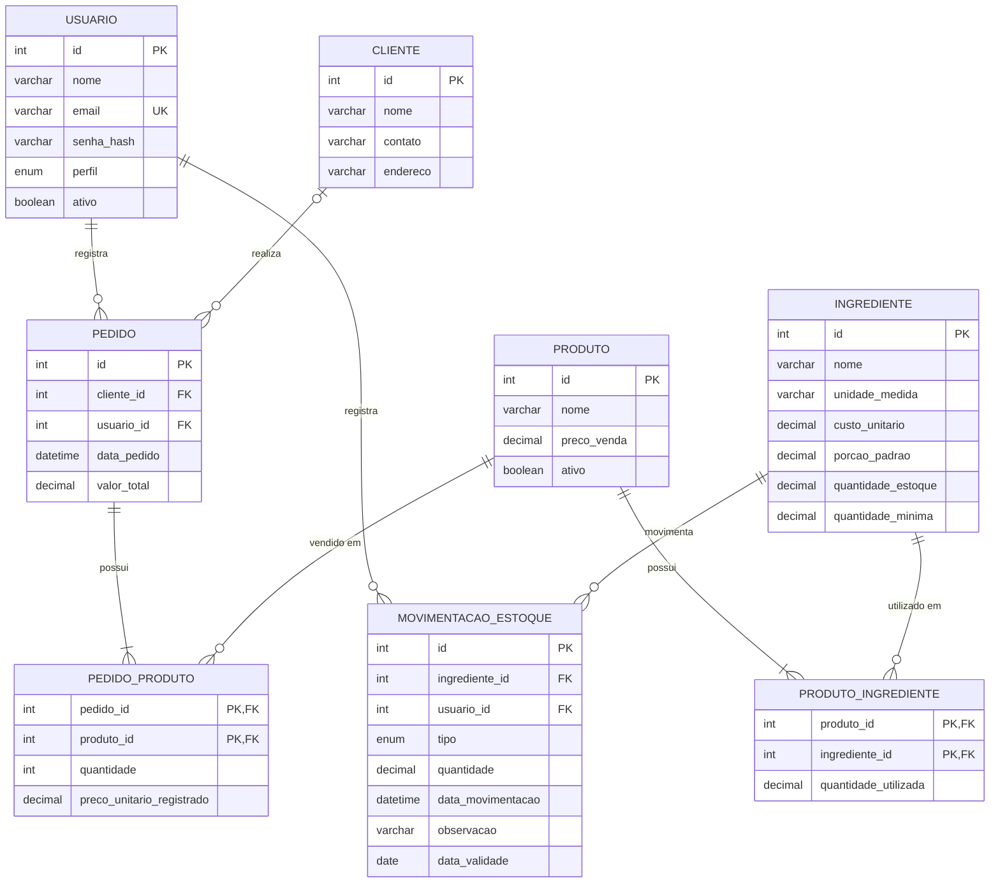

# DER — Mente Fria

**Equipe:** Leonardo Fagundes Oliveira (RA 2840482421009), Diogo Pereira Miranda (RA 2840482423006), Lucas Gabriel Valadares Bassi (RA 2840482423008), Kauê Nogueira Carneiro (RA 2840482423039)

**Trilha:** B (Origem do problema: Cliente Real)

---

## 1. Diagrama

---

## 2. Dicionário de dados

### Tabela: `usuario`
Representa tanto o Administrador (Proprietário) quanto o Funcionário. Como as duas subclasses do diagrama de classes (E3a) não possuem atributos próprios, elas foram unificadas em uma única tabela com coluna discriminadora `perfil`.

| Campo | Tipo | Restrições | Descrição |
|---|---|---|---|
| id | INT | PK, AUTO_INCREMENT | Identificador do usuário |
| nome | VARCHAR(150) | NOT NULL | Nome do usuário |
| email | VARCHAR(150) | NOT NULL, UNIQUE | E-mail de login (único no sistema) |
| senha_hash | VARCHAR(255) | NOT NULL | Hash da senha (mínimo 8 caracteres na origem, validado na aplicação) |
| perfil | ENUM('ADMINISTRADOR','FUNCIONARIO') | NOT NULL | Perfil de acesso, define permissões e redirecionamento |
| ativo | BOOLEAN | NOT NULL, DEFAULT TRUE | Indica se o usuário está ativo no sistema |

### Tabela: `cliente`
| Campo | Tipo | Restrições | Descrição |
|---|---|---|---|
| id | INT | PK, AUTO_INCREMENT | Identificador do cliente |
| nome | VARCHAR(150) | NOT NULL | Nome do cliente |
| contato | VARCHAR(50) | NOT NULL | Telefone ou contato do cliente |
| endereco | VARCHAR(255) | NOT NULL | Endereço do cliente |

### Tabela: `ingrediente`
| Campo | Tipo | Restrições | Descrição |
|---|---|---|---|
| id | INT | PK, AUTO_INCREMENT | Identificador do ingrediente |
| nome | VARCHAR(100) | NOT NULL | Nome do ingrediente |
| unidade_medida | VARCHAR(20) | NOT NULL | Unidade de medida (kg, l, un, etc.) |
| custo_unitario | DECIMAL(10,2) | NOT NULL, CHECK (custo_unitario >= 0) | Custo por unidade de medida |
| porcao_padrao | DECIMAL(10,3) | NOT NULL, CHECK (porcao_padrao > 0) | Porção padrão utilizada como referência |
| quantidade_estoque | DECIMAL(10,3) | NOT NULL, DEFAULT 0, CHECK (quantidade_estoque >= 0) | Saldo atual em estoque (mantido pelas movimentações de entrada/saída) |
| quantidade_minima | DECIMAL(10,3) | NOT NULL, DEFAULT 0, CHECK (quantidade_minima >= 0) | Quantidade mínima antes de disparar alerta de reposição |

### Tabela: `produto`
| Campo | Tipo | Restrições | Descrição |
|---|---|---|---|
| id | INT | PK, AUTO_INCREMENT | Identificador do produto |
| nome | VARCHAR(100) | NOT NULL | Nome do produto (copo de açaí) |
| preco_venda | DECIMAL(10,2) | NOT NULL, CHECK (preco_venda > 0) | Preço de venda atual, restrito ao Administrador |
| ativo | BOOLEAN | NOT NULL, DEFAULT TRUE | Indica se o produto está ativo para venda |

### Tabela: `produto_ingrediente`
Tabela associativa que resolve o relacionamento N:N entre `produto` e `ingrediente` (equivalente física da classe associativa `ComposicaoProduto` do diagrama de classes).

| Campo | Tipo | Restrições | Descrição |
|---|---|---|---|
| produto_id | INT | PK, FK → produto(id) | Produto composto |
| ingrediente_id | INT | PK, FK → ingrediente(id) | Ingrediente utilizado |
| quantidade_utilizada | DECIMAL(10,3) | NOT NULL, CHECK (quantidade_utilizada > 0) | Quantidade do ingrediente usada nesse produto |

### Tabela: `pedido`
| Campo | Tipo | Restrições | Descrição |
|---|---|---|---|
| id | INT | PK, AUTO_INCREMENT | Identificador do pedido |
| cliente_id | INT | FK → cliente(id), NULL | Cliente associado (opcional) |
| usuario_id | INT | NOT NULL, FK → usuario(id) | Usuário (Administrador/Funcionário) que registrou o pedido |
| data_pedido | DATETIME | NOT NULL, DEFAULT CURRENT_TIMESTAMP | Data e hora do pedido |
| valor_total | DECIMAL(10,2) | NOT NULL, DEFAULT 0, CHECK (valor_total >= 0) | Valor total do pedido (mantido a partir dos itens) |

### Tabela: `pedido_produto`
Tabela associativa que resolve o relacionamento N:N entre `pedido` e `produto` (equivalente física da classe associativa `ItemPedido`).

| Campo | Tipo | Restrições | Descrição |
|---|---|---|---|
| pedido_id | INT | PK, FK → pedido(id) | Pedido |
| produto_id | INT | PK, FK → produto(id) | Produto vendido |
| quantidade | INT | NOT NULL, CHECK (quantidade > 0) | Quantidade vendida do produto |
| preco_unitario_registrado | DECIMAL(10,2) | NOT NULL, CHECK (preco_unitario_registrado > 0) | Preço praticado no momento da venda |

### Tabela: `movimentacao_estoque`
| Campo | Tipo | Restrições | Descrição |
|---|---|---|---|
| id | INT | PK, AUTO_INCREMENT | Identificador da movimentação |
| ingrediente_id | INT | NOT NULL, FK → ingrediente(id) | Ingrediente movimentado |
| usuario_id | INT | NOT NULL, FK → usuario(id) | Usuário que registrou a movimentação |
| tipo | ENUM('ENTRADA','SAIDA') | NOT NULL | Tipo de movimentação |
| quantidade | DECIMAL(10,3) | NOT NULL, CHECK (quantidade > 0) | Quantidade movimentada |
| data_movimentacao | DATETIME | NOT NULL, DEFAULT CURRENT_TIMESTAMP | Data e hora da movimentação |
| observacao | VARCHAR(255) | NULL | Observação livre sobre a movimentação |
| data_validade | DATE | NULL, CHECK (tipo = 'ENTRADA' OR data_validade IS NULL) | Data de validade do lote recebido nessa movimentação; preenchida somente em movimentações do tipo `ENTRADA`. Em movimentações do tipo `SAIDA` é sempre `NULL` (a constraint `chk_movimentacao_data_validade` impede preenchê-la nesse caso) |

> **Nota:** a `data_validade` é registrada por movimentação (não mais em `ingrediente`) porque cada `ENTRADA` de estoque pode representar um lote com validade diferente das entradas anteriores. Por isso o campo só faz sentido para `ENTRADA` — uma `SAIDA` apenas consome estoque já existente e não introduz uma validade nova. O UC16/US16 (alerta de vencimento) e o método `estaProximoDoVencimento` (ver `Diagramas_UML.md`) devem considerar apenas movimentações com `tipo = 'ENTRADA'` e `data_validade IS NOT NULL`.

> **Nota:** as tabelas `recomendacao_producao`, `item_recomendacao_producao`, `recomendacao_reposicao`, `item_recomendacao_reposicao` e `sugestao_marketing` saíram deste DER. As funcionalidades de recomendação de produção (UC10, UC11), recomendação de reposição (UC14) e sugestão de marketing (UC18) continuam no sistema, mas passaram a ser calculadas sob demanda pela aplicação — sem persistir o histórico de cálculo — por isso não têm mais tabela própria. A otimização de produção (UC10) é resolvida via Programação Linear (Python, biblioteca Gurobi); o resultado é mantido em memória (RAM) do processo, não em banco de dados.

> **Nota:** o saldo agregado em `ingrediente.quantidade_estoque` continua sendo a fonte única de disponibilidade do ingrediente (não há tabela de lotes). Quando um pedido é registrado (UC12) e o estoque é baixado automaticamente, a aplicação seleciona, entre as movimentações de `ENTRADA` do ingrediente, aquela(s) com a menor `data_validade` ainda não totalmente consumida para orientar essa baixa (lógica FEFO — *First Expire, First Out*), reduzindo o risco de perdas por vencimento. Essa seleção é apenas um critério de negócio aplicado no momento da baixa; o saldo consolidado do ingrediente permanece único em `ingrediente.quantidade_estoque`, e a baixa gera uma nova movimentação de `SAIDA` (sem `data_validade` própria).
