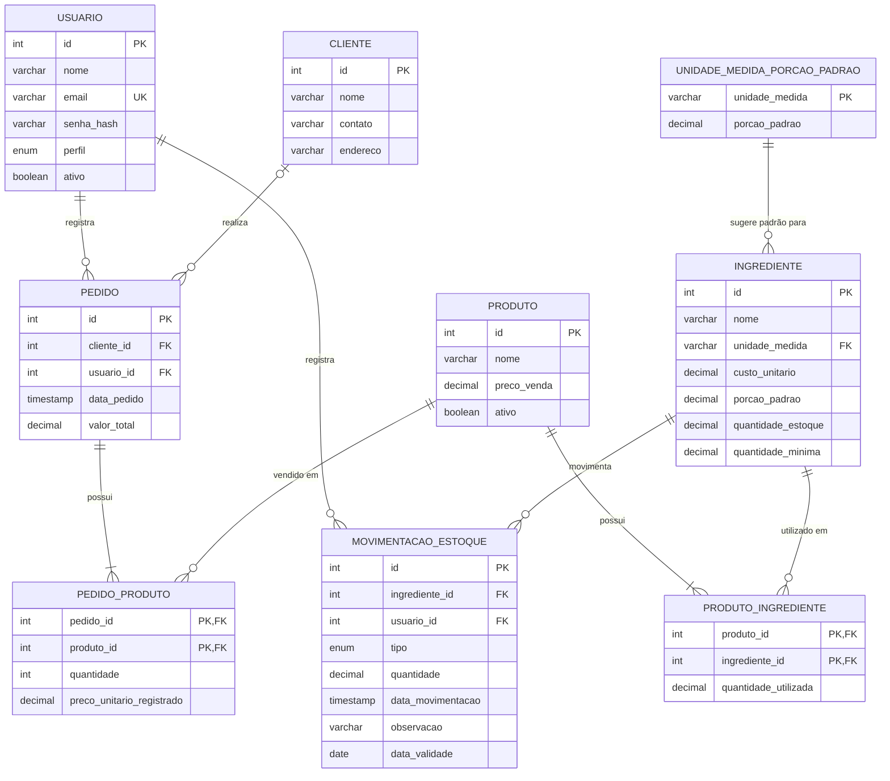

# DER — Mente Fria

**Equipe:** Leonardo Fagundes Oliveira (RA 2840482421009), Diogo Pereira Miranda (RA 2840482423006), Lucas Gabriel Valadares Bassi (RA 2840482423008), Kauê Nogueira Carneiro (RA 2840482423039)

**Trilha:** B (Origem do problema: Cliente Real)

> **Nota de revisão (16/09/2026):** o banco de dados oficial do projeto passou de **MySQL** para **PostgreSQL**, motivado pela ferramenta de deploy escolhida (Render) — ver justificativa completa e as decisões de sintaxe (tipos, auto-incremento) na nota ao final deste documento. O Termo de Aceite e o `Script_DDL.sql` foram atualizados na mesma revisão.

---

## 1. Diagrama

---

## 2. Dicionário de dados

### Tabela: `usuario`
Representa tanto o Administrador (Proprietário) quanto o Funcionário. Como as duas subclasses do diagrama de classes (E3a) não possuem atributos próprios, elas foram unificadas em uma única tabela com coluna discriminadora `perfil`.

| Campo | Tipo | Restrições | Descrição |
|---|---|---|---|
| id | INT | PK, GENERATED ALWAYS AS IDENTITY | Identificador do usuário |
| nome | VARCHAR(150) | NOT NULL | Nome do usuário |
| email | VARCHAR(150) | NOT NULL, UNIQUE | E-mail de login (único no sistema) |
| senha_hash | VARCHAR(255) | NOT NULL | Hash da senha (mínimo 8 caracteres na origem, validado na aplicação) |
| perfil | VARCHAR(20) | NOT NULL, CHECK (perfil IN ('ADMINISTRADOR','FUNCIONARIO')) | Perfil de acesso, define permissões e redirecionamento |
| ativo | BOOLEAN | NOT NULL, DEFAULT TRUE | Indica se o usuário está ativo no sistema |

### Tabela: `cliente`
| Campo | Tipo | Restrições | Descrição |
|---|---|---|---|
| id | INT | PK, GENERATED ALWAYS AS IDENTITY | Identificador do cliente |
| nome | VARCHAR(150) | NOT NULL | Nome do cliente |
| contato | VARCHAR(50) | NOT NULL | Telefone ou contato do cliente |
| endereco | VARCHAR(255) | NOT NULL | Endereço do cliente |

### Tabela: `unidade_medida_porcao_padrao` **(nova — US26/UC20)**
Armazena, por unidade de medida, um valor de porção padrão usado apenas como **sugestão de pré-preenchimento** ao cadastrar um novo ingrediente daquela unidade (Tela 19 do protótipo navegável). Não substitui `ingrediente.porcao_padrao`, que continua sendo o valor individual e efetivo usado em todos os cálculos de negócio.

| Campo | Tipo | Restrições | Descrição |
|---|---|---|---|
| unidade_medida | VARCHAR(20) | PK | Unidade de medida (kg, l, un, mg, ml, etc.) |
| porcao_padrao | DECIMAL(10,3) | NOT NULL, CHECK (porcao_padrao > 0) | Valor sugerido ao cadastrar um novo ingrediente dessa unidade |

### Tabela: `ingrediente`
| Campo | Tipo | Restrições | Descrição |
|---|---|---|---|
| id | INT | PK, GENERATED ALWAYS AS IDENTITY | Identificador do ingrediente |
| nome | VARCHAR(100) | NOT NULL | Nome do ingrediente |
| unidade_medida | VARCHAR(20) | NOT NULL, FK → unidade_medida_porcao_padrao(unidade_medida) | Unidade de medida (kg, l, un, etc.); deve existir previamente em `unidade_medida_porcao_padrao` |
| custo_unitario | DECIMAL(10,2) | NOT NULL, CHECK (custo_unitario >= 0) | Custo por unidade de medida |
| porcao_padrao | DECIMAL(10,3) | NOT NULL, CHECK (porcao_padrao > 0) | Porção padrão **efetiva** deste ingrediente, usada nos cálculos de negócio; pode divergir do valor sugerido em `unidade_medida_porcao_padrao` para a mesma unidade |
| quantidade_estoque | DECIMAL(10,3) | NOT NULL, DEFAULT 0, CHECK (quantidade_estoque >= 0) | Saldo atual em estoque (mantido pelas movimentações de entrada/saída) |
| quantidade_minima | DECIMAL(10,3) | NOT NULL, DEFAULT 0, CHECK (quantidade_minima >= 0) | Quantidade mínima antes de disparar alerta de reposição |

### Tabela: `produto`
| Campo | Tipo | Restrições | Descrição |
|---|---|---|---|
| id | INT | PK, GENERATED ALWAYS AS IDENTITY | Identificador do produto |
| nome | VARCHAR(100) | NOT NULL | Nome do produto (copo de açaí) |
| preco_venda | DECIMAL(10,2) | NOT NULL, CHECK (preco_venda > 0) | Preço de venda atual, restrito ao Administrador |
| ativo | BOOLEAN | NOT NULL, DEFAULT TRUE | Indica se o produto está ativo para venda |

### Tabela: `produto_ingrediente`
Tabela associativa que resolve o relacionamento N:N entre `produto` e `ingrediente` (equivalente física da classe associativa `ComposicaoProduto` do diagrama de classes).

| Campo | Tipo | Restrições | Descrição |
|---|---|---|---|
| produto_id | INT | PK, FK → produto(id) | Produto composto |
| ingrediente_id | INT | PK, FK → ingrediente(id) | Ingrediente utilizado |
| quantidade_utilizada | DECIMAL(10,3) | NOT NULL, CHECK (quantidade_utilizada > 0) | Quantidade do ingrediente usada nesse produto |

### Tabela: `pedido`
| Campo | Tipo | Restrições | Descrição |
|---|---|---|---|
| id | INT | PK, GENERATED ALWAYS AS IDENTITY | Identificador do pedido |
| cliente_id | INT | FK → cliente(id), NULL | Cliente associado (opcional) |
| usuario_id | INT | NOT NULL, FK → usuario(id) | Usuário (Administrador/Funcionário) que registrou o pedido |
| data_pedido | TIMESTAMP | NOT NULL, DEFAULT CURRENT_TIMESTAMP | Data e hora do pedido |
| valor_total | DECIMAL(10,2) | NOT NULL, DEFAULT 0, CHECK (valor_total >= 0) | Valor total do pedido (mantido a partir dos itens) |

### Tabela: `pedido_produto`
Tabela associativa que resolve o relacionamento N:N entre `pedido` e `produto` (equivalente física da classe associativa `ItemPedido`).

| Campo | Tipo | Restrições | Descrição |
|---|---|---|---|
| pedido_id | INT | PK, FK → pedido(id) | Pedido |
| produto_id | INT | PK, FK → produto(id) | Produto vendido |
| quantidade | INT | NOT NULL, CHECK (quantidade > 0) | Quantidade vendida do produto |
| preco_unitario_registrado | DECIMAL(10,2) | NOT NULL, CHECK (preco_unitario_registrado > 0) | Preço praticado no momento da venda |

### Tabela: `movimentacao_estoque`
| Campo | Tipo | Restrições | Descrição |
|---|---|---|---|
| id | INT | PK, GENERATED ALWAYS AS IDENTITY | Identificador da movimentação |
| ingrediente_id | INT | NOT NULL, FK → ingrediente(id) | Ingrediente movimentado |
| usuario_id | INT | NOT NULL, FK → usuario(id) | Usuário que registrou a movimentação |
| tipo | VARCHAR(10) | NOT NULL, CHECK (tipo IN ('ENTRADA','SAIDA')) | Tipo de movimentação |
| quantidade | DECIMAL(10,3) | NOT NULL, CHECK (quantidade > 0) | Quantidade movimentada |
| data_movimentacao | TIMESTAMP | NOT NULL, DEFAULT CURRENT_TIMESTAMP | Data e hora da movimentação |
| observacao | VARCHAR(255) | NULL | Observação livre sobre a movimentação |
| data_validade | DATE | NULL, CHECK (tipo = 'ENTRADA' OR data_validade IS NULL) | Data de validade do lote recebido nessa movimentação; preenchida somente em movimentações do tipo `ENTRADA`. Em movimentações do tipo `SAIDA` é sempre `NULL` (a constraint `chk_movimentacao_data_validade` impede preenchê-la nesse caso) |

> **Nota:** a `data_validade` é registrada por movimentação (não mais em `ingrediente`) porque cada `ENTRADA` de estoque pode representar um lote com validade diferente das entradas anteriores. Por isso o campo só faz sentido para `ENTRADA` — uma `SAIDA` apenas consome estoque já existente e não introduz uma validade nova. O UC16/US16 (alerta de vencimento) e o método `estaProximoDoVencimento` (ver `Diagramas_UML.md`) devem considerar apenas movimentações com `tipo = 'ENTRADA'` e `data_validade IS NOT NULL`.

> **Nota:** as tabelas `recomendacao_producao`, `item_recomendacao_producao`, `recomendacao_reposicao`, `item_recomendacao_reposicao` e `sugestao_marketing` saíram deste DER. As funcionalidades de recomendação de produção (UC10, UC11), recomendação de reposição (UC14) e sugestão de marketing (UC18) continuam no sistema, mas passaram a ser calculadas sob demanda pela aplicação — sem persistir o histórico de cálculo — por isso não têm mais tabela própria. A otimização de produção (UC10) é resolvida via Programação Linear (Python, biblioteca Gurobi); o resultado é mantido em memória (RAM) do processo, não em banco de dados.

> **Nota:** o saldo agregado em `ingrediente.quantidade_estoque` continua sendo a fonte única de disponibilidade do ingrediente (não há tabela de lotes). Quando um pedido é registrado (UC12) e o estoque é baixado automaticamente, a aplicação seleciona, entre as movimentações de `ENTRADA` do ingrediente, aquela(s) com a menor `data_validade` ainda não totalmente consumida para orientar essa baixa (lógica FEFO — *First Expire, First Out*), reduzindo o risco de perdas por vencimento. Essa seleção é apenas um critério de negócio aplicado no momento da baixa; o saldo consolidado do ingrediente permanece único em `ingrediente.quantidade_estoque`, e a baixa gera uma nova movimentação de `SAIDA` (sem `data_validade` própria).

> **Nota (US26/UC20 — porção padrão por unidade, adicionada nesta revisão):** `unidade_medida_porcao_padrao.porcao_padrao` é apenas o valor **sugerido** para pré-preencher o formulário de cadastro de um novo ingrediente daquela unidade. O valor efetivo usado nos cálculos de negócio (`Ingrediente.calcularQuantidadeRecomendadaCompra`, composição de produto, etc.) é sempre `ingrediente.porcao_padrao`, que pode divergir livremente do padrão da unidade — por exemplo, o Açaí pode ter uma porção diferente dos demais ingredientes medidos em `kg`. Alterar o padrão de uma unidade **não** recalcula retroativamente ingredientes já cadastrados; o novo valor só é usado como sugestão em cadastros futuros.

> **Nota (US26/UC20):** a FK `ingrediente.unidade_medida → unidade_medida_porcao_padrao.unidade_medida` torna obrigatório que a unidade já esteja cadastrada em `unidade_medida_porcao_padrao` antes de se cadastrar um ingrediente com essa unidade — na prática, a Tela 19 passa a ser um pré-requisito de fluxo da Tela 07 (Ingredientes: Novo/Editar). O `Script_DDL.sql` inclui um `INSERT` inicial (seed) com as cinco unidades da Tela 19 (`kg`, `mg`, `l`, `ml`, `un`) para não bloquear ambientes recém-criados a partir do schema atual — na Sprint 1 as unidades chegam ao banco somente por esse seed, pois a tela de gestão de unidades (US26) só entra na Sprint 3.

> **Nota de decisão técnica (16/09/2026) — migração de MySQL para PostgreSQL:** motivada pela escolha do Render como plataforma de deploy. O Render não oferece MySQL como banco gerenciado — só é possível rodá-lo via Docker (imagem oficial) com um disco persistente, o que exige um plano pago (o plano Free do Render não permite disco persistente nem "private services"). Já o PostgreSQL é um banco gerenciado nativo do Render, com um plano Free genuíno (a única limitação real: 1 GB de armazenamento e expiração a cada 30 dias, com 14 dias de carência para migrar para um plano pago antes da exclusão — a equipe pode recriar o banco Free periodicamente durante o semestre, ou migrar para o plano pago (a partir de US$ 6-7/mês) perto da entrega final, se preferir não depender disso). Essa mudança trouxe três adaptações de sintaxe, refletidas neste documento e no `Script_DDL.sql`:
> 1. **Colunas de auto-incremento:** `AUTO_INCREMENT` (MySQL) não existe em PostgreSQL. Optamos por `GENERATED ALWAYS AS IDENTITY`, a forma padrão SQL (compatível com o padrão SQL:2003) recomendada atualmente pela documentação do PostgreSQL, em vez do pseudo-tipo legado `SERIAL`.
> 2. **Colunas ENUM:** PostgreSQL não tem o `ENUM(...)` inline do MySQL — um tipo enumerado nativo exigiria `CREATE TYPE ... AS ENUM (...)` à parte, o que é mais rígido para alterar depois (exige `ALTER TYPE`, não pode ser feito dentro de uma transação em versões mais antigas). Optamos por `VARCHAR` + `CHECK (coluna IN (...))`, que tem o mesmo efeito de restringir os valores aceitos, mas é mais simples de alterar no futuro (basta um `ALTER TABLE ... DROP/ADD CONSTRAINT`). Afetou `usuario.perfil` e `movimentacao_estoque.tipo`.
> 3. **Datas com hora:** `DATETIME` (MySQL) vira `TIMESTAMP` em PostgreSQL — mapeamento direto, sem mudança de comportamento (nenhum dos dois grava fuso horário). Afetou `pedido.data_pedido` e `movimentacao_estoque.data_movimentacao`.
>
> Nenhuma dessas três é uma mudança de modelo — apenas de sintaxe física — mas fica registrada aqui porque `AUTO_INCREMENT`/`ENUM` apareciam explicitamente na coluna "Restrições" deste dicionário. **Pendências para a equipe:** (a) confirmar a versão do PostgreSQL a fixar localmente e no Testcontainers, alinhada à oferecida pelo Render no momento da criação do banco (17 ou 18 conforme documentação do Render em 2026); (b) cada integrante precisa trocar o PostgreSQL local (em vez do MySQL) no ambiente de desenvolvimento — ver seção de ambiente no README quando ele existir.
