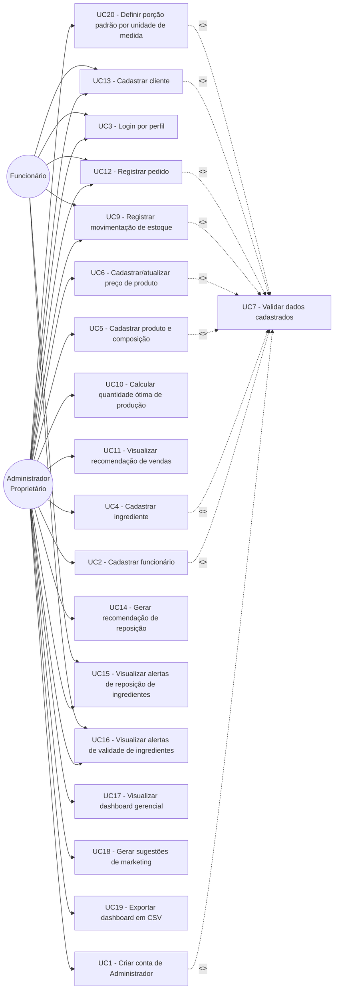
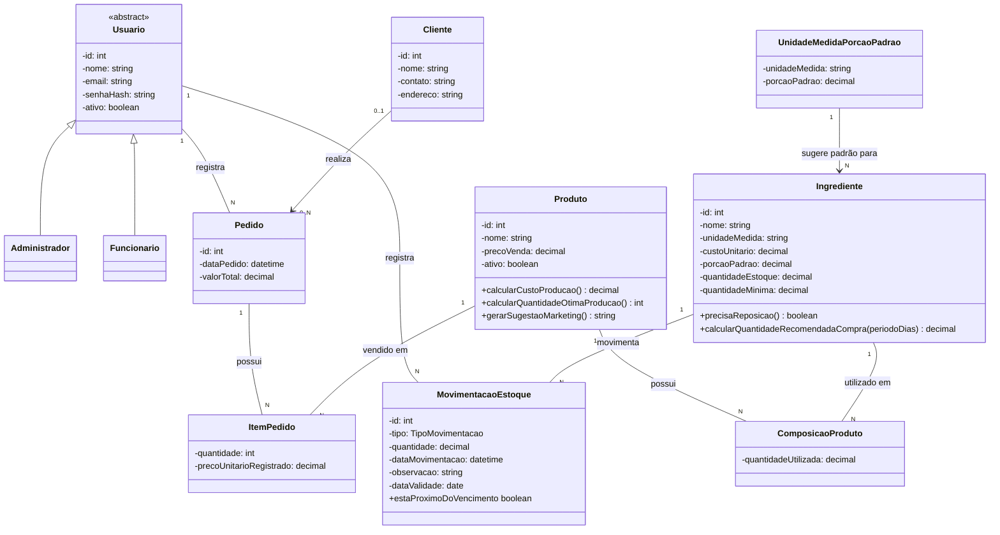

# Diagramas UML — Mente Fria

**Equipe:** Leonardo Fagundes Oliveira (RA 2840482421009), Diogo Pereira Miranda (RA 2840482423006), Lucas Gabriel Valadares Bassi (RA 2840482423008), Kauê Nogueira Carneiro (RA 2840482423039)

**Trilha:** B (Origem do problema: Cliente Real)

---

## 1. Diagrama de Casos de Uso

> **Observação:** US8 (repositório Git com README) e US20 (deploy público por URL) são requisitos não-funcionais/de entrega do projeto (cobertos no Documento de Visão, seção 6, e no Termo de Aceite, seção 2), não funcionalidades acionadas por um ator dentro do sistema — por isso não aparecem como casos de uso. As histórias US21 a US25 estão marcadas como **Won't** no Backlog Priorizado (fora do escopo do semestre) e, portanto, também não têm caso de uso correspondente.
>
> **Observação (atualizada em 18/09/2026):** UC20 corresponde a **US26 — Definir porção padrão por unidade de medida**, história derivada da Tela 19 do protótipo navegável e já incluída em `Backlog_Priorizado_Mente_Fria.docx`, com prioridade **Could**, estimativa **P** e alvo **Sprint 3**. Assim como as demais histórias de cadastro, UC20 inclui (`<<include>>`) UC7 porque a validação `porcao_padrao > 0` é uma regra transversal.

---

## 2. Diagrama de Classes

`ComposicaoProduto` e `ItemPedido` representam, no nível conceitual, as classes associativas que resolvem os relacionamentos N:N entre Produto/Ingrediente e Pedido/Produto citados no Documento de Visão (seção 6). No DER (nível físico, `docs/der.md`) esses relacionamentos são implementados como tabelas associativas (`produto_ingrediente` e `pedido_produto`).

As funcionalidades de recomendação de produção (UC10, UC11), recomendação de reposição (UC14) e sugestão de marketing (UC18) continuam no sistema, mas passaram a ser calculadas sob demanda — via `Produto.calcularQuantidadeOtimaProducao()`, `Produto.gerarSugestaoMarketing()` e `Ingrediente.calcularQuantidadeRecomendadaCompra(periodoDias)` — sem persistir o histórico de cálculo. Por isso `RecomendacaoProducao`, `ItemRecomendacaoProducao`, `RecomendacaoReposicao`, `ItemRecomendacaoReposicao` e `SugestaoMarketing` saíram do diagrama e não têm mais tabela correspondente no DER (`docs/der.md`).

O atributo `dataValidade`, antes em `Ingrediente`, passou para `MovimentacaoEstoque`, pois cada `ENTRADA` de estoque pode corresponder a um lote com validade diferente das entradas anteriores do mesmo ingrediente. Por isso `dataValidade` só é preenchida quando `tipo = ENTRADA`; em uma `SAIDA` ela permanece nula, já que a saída apenas consome estoque já existente. Essa regra é garantida no nível físico pela constraint `chk_movimentacao_data_validade` do DER (`docs/der.md`). Consequentemente, `estaProximoDoVencimento` e os UC16/US16 (alerta de vencimento) devem consultar apenas movimentações do tipo `ENTRADA` com `dataValidade` preenchida.

`UnidadeMedidaPorcaoPadrao` (nova nesta revisão, US26/UC20) mantém um valor de `porcaoPadrao` por `unidadeMedida`, usado somente como **sugestão de pré-preenchimento** ao cadastrar um novo `Ingrediente` daquela unidade. O valor efetivo, usado em todos os cálculos de negócio (`calcularQuantidadeRecomendadaCompra`, composição de produto etc.), é sempre `Ingrediente.porcaoPadrao` — que pode divergir do padrão da unidade (ex.: Açaí com porção diferente dos demais ingredientes em `kg`). No DER, essa relação é implementada como uma FK obrigatória de `ingrediente.unidade_medida` para `unidade_medida_porcao_padrao.unidade_medida`.

---

## 3. Rastreabilidade — caso de uso → história do backlog

| Caso de uso | História(s) relacionada(s) (E2) |
|---|---|
| UC1 — Criar conta de Administrador | US1 |
| UC2 — Cadastrar funcionário | US2 |
| UC3 — Login por perfil | US3 |
| UC4 — Cadastrar ingrediente | US4 |
| UC5 — Cadastrar produto e composição | US5 |
| UC6 — Cadastrar/atualizar preço de produto | US6 |
| UC7 — Validar dados cadastrados | US7 (US7 é uma história transversal e seu comportamento é incluído (<<include>>) pelos casos de uso que realizam cadastro ou alteração de dados.) |
| UC9 — Registrar movimentação de estoque | US9 |
| UC10 — Calcular quantidade ótima de produção | US10 |
| UC11 — Visualizar recomendação de vendas | US11 |
| UC12 — Registrar pedido | US12 |
| UC13 — Cadastrar cliente | US13 |
| UC14 — Gerar recomendação de reposição | US14 |
| UC15 — Visualizar alertas de reposição de ingredientes | US15 |
| UC16 — Visualizar alertas de validade de ingredientes | US16 |
| UC17 — Visualizar dashboard gerencial | US17 |
| UC18 — Gerar sugestões de marketing | US18 |
| UC19 — Exportar dashboard em CSV | US19 |
| UC20 — Definir porção padrão por unidade de medida | US26 |
